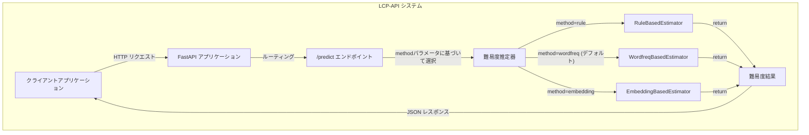

# LCP-API: テキスト難易度推定API  
  
  
  
  
  
  
## 概要  
  
LCP-API（Language Complexity Predictor API）は、日本語テキストの難易度を自動的に推定するためのRESTful APIサービスです。複数の推定アルゴリズムを提供し、テキストの複雑さを1〜5のスケールで評価します。  
  
## 特徴  
  
- **複数の推定方法**: 3種類の異なる難易度推定アルゴリズムをサポート  
  - ルールベース（単語数に基づく簡易推定）  
  - 単語頻度ベース（単語の一般的な使用頻度に基づく推定）  
  - 埋め込みベース（トランスフォーマーモデルを使用した推定）仮  
- **シンプルなAPI**: 使いやすいRESTful APIインターフェース  
- **高速なレスポンス**: 効率的な処理による迅速な結果提供  
- **Dockerコンテナ化**: 簡単なデプロイと一貫した実行環境  
  
## システムアーキテクチャ  
  
LCP-APIは、クリーンでモジュラーな設計に基づいています。システムは以下のコンポーネントで構成されています：  
  


## インストール方法
```bash
### リポジトリのクローン
git clone https://github.com/areldai03/lcp-api.git  
cd lcp-api  
  
### コンテナの起動
docker compose up
```

## 使用方法
```bash
# デフォルトの推定方法（wordfreq）を使用 [rule, wordfreq, embedding]
curl -X POST "http://localhost:8000/predict?method=wordfreq" \  
     -H "Content-Type: application/json" \  
     -d '{"text": "これは難易度を推定するためのテキストです。"}'
